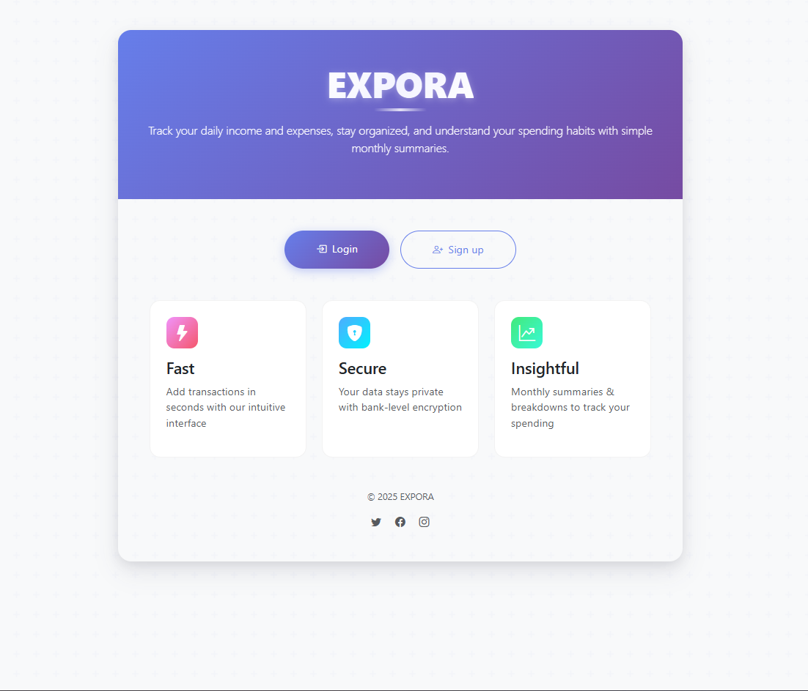
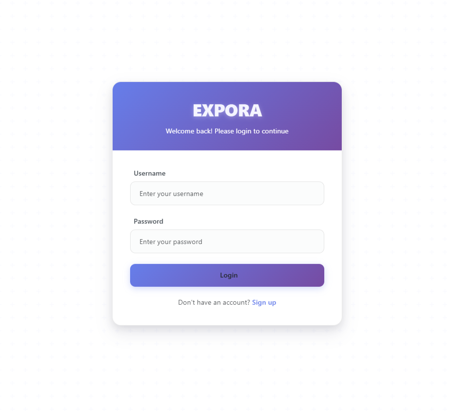
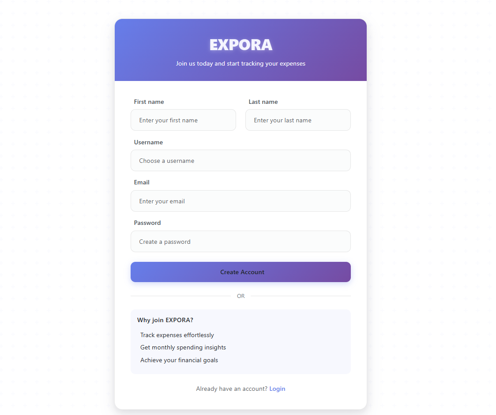
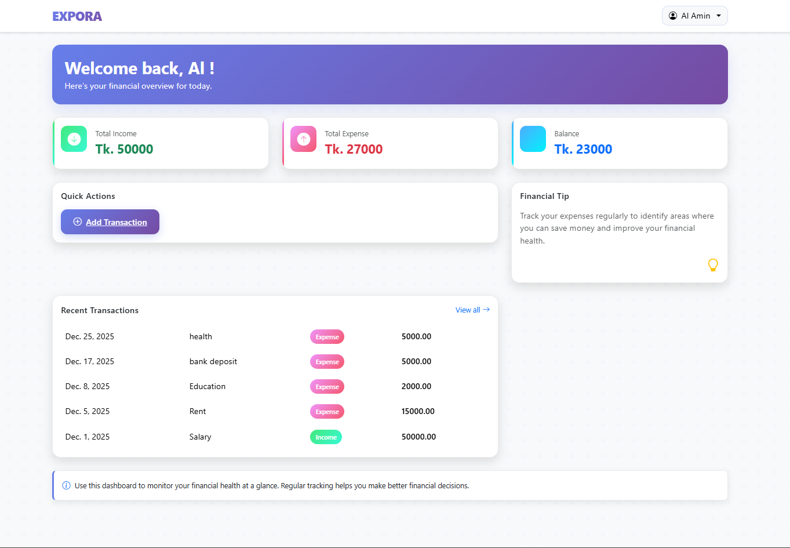
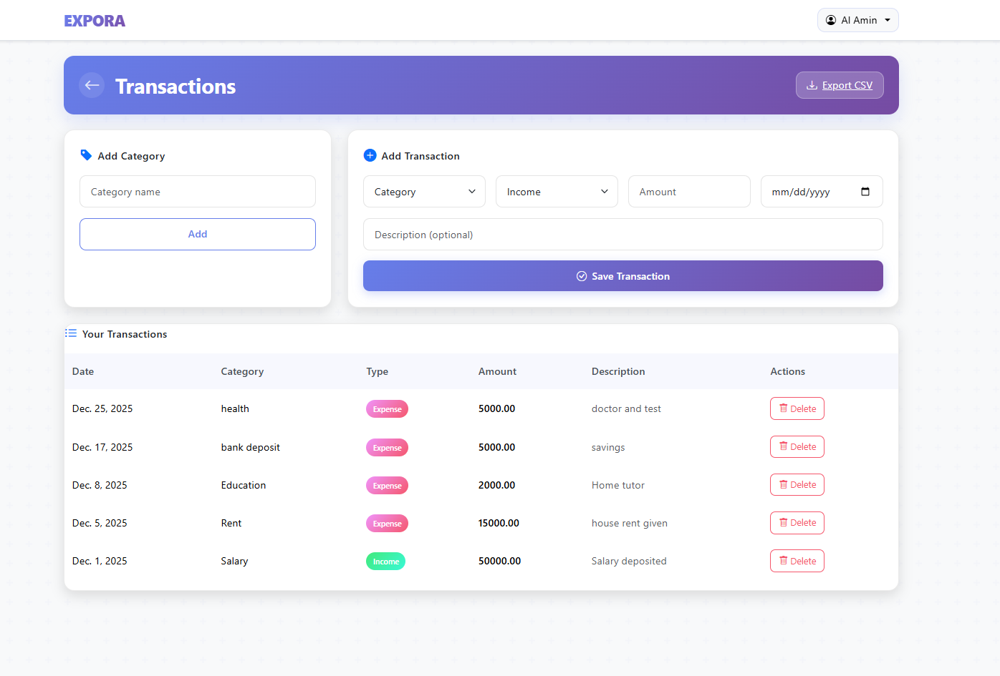
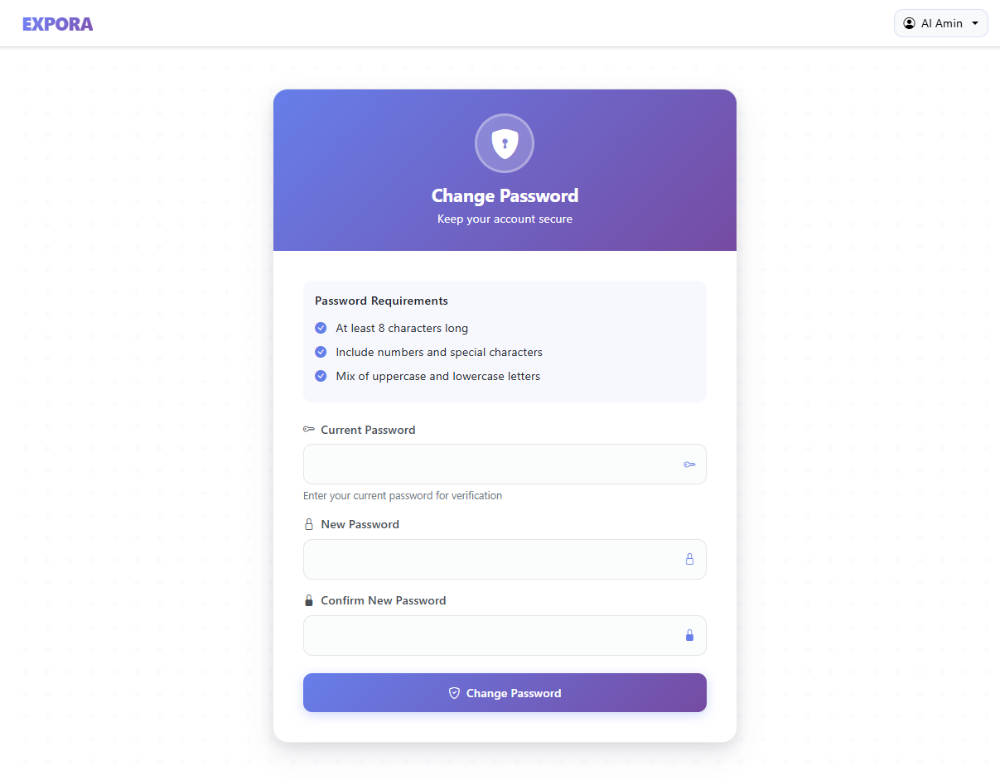

# 📊 EXPORA – Expense Tracking Made Simple

**EXPORA** is a backend-driven expense tracking web application built with **Django** that helps users track their daily income and expenses, understand spending habits, and maintain better financial control — all through a clean, intuitive interface.

> 🔗 **Live Demo:** _(Coming soon)_  
> 👤 **Demo Access:** Users can sign up and try the system freely

---

## 🧩 Problem Statement

Managing daily expenses is often fragmented across notes, spreadsheets, or memory.  
This leads to:
- Poor visibility into spending
- Difficulty tracking income vs expenses
- No clear monthly insights

**EXPORA** solves this by providing a **simple, secure, and centralized system** where users can track finances effortlessly and view meaningful summaries.

---

## ✨ Key Features

### 🔐 Authentication & User Management
- User signup & login
- Secure session-based authentication
- Profile editing (name, email)
- Password change functionality

### 💸 Expense & Income Tracking
- Add income and expense transactions
- Inline category creation (no separate category page)
- Soft delete support (data safety)
- User-isolated data (each user sees only their data)

### 📈 Analytics & Insights
- Total income, expense, and balance overview
- Recent transactions snapshot
- Monthly summaries and breakdowns

### 📤 Data Export
- Export all transactions as **CSV**
- Useful for reports or external analysis

### 🎨 Clean & Modern UI
- Responsive layout using Bootstrap
- Minimal, distraction-free design
- Dashboard-first user experience
- Smooth navigation between dashboard and transactions

---

## 🖼️ Application Screenshots

> 📁 Screenshots are stored in the `screenshots/` folder

### Landing Page


### Login Page


### Signup Page


### Dashboard


### Transactions


### Change Password


---

## 🛠 Tech Stack

### Backend
- Django
- Django REST Framework
- Django ORM (aggregations & analytics)
- Session-based authentication
- JWT support for API endpoints

### Frontend
- Django Templates
- HTML5, CSS3
- Bootstrap 5

### Database
- SQLite (development)

---

## 🏗 Architecture Highlights

- Backend-first design philosophy
- Clean separation of concerns
- Secure permission handling
- Scalable, production-style Django structure
- Minimal JavaScript (logic handled server-side)

---

## ⚙️ Installation & Setup (Local)

### 1. Clone the repository
```bash
git clone https://github.com/alaminpiyal2002/EXPORA.git
cd EXPORA
```

### 2. Create & activate virtual environment
```bash
python -m venv venv
source venv/bin/activate
```
### 3. Install dependencies
```bash
pip install -r requirements.txt
```
### 4. Apply migrations
```bash
python manage.py migrate
```
### 5. Run the server
```bash
python manage.py runserver
```
Visit: http://127.0.0.1:8000/

---

### 🚀 Usage Flow

- Visit landing page
- Sign up or log in
- Access dashboard
- Add categories & transactions
- View summaries and recent activity
- Export data if needed

### Project Goals & Learning Outcomes
This project was built to:

- Demonstrate real-world Django backend skills
- Apply secure authentication and permissions
- Design a usable, clean UI without heavy JS
- Build a portfolio-ready, deployable product

### Future Improvements

- Charts & visual analytics
- Monthly reports
- Multi-currency support
- Dark mode

###👤 Author
Al Amin
Backend-Focused Django Developer
🔗 GitHub: https://github.com/alaminpiyal2002
